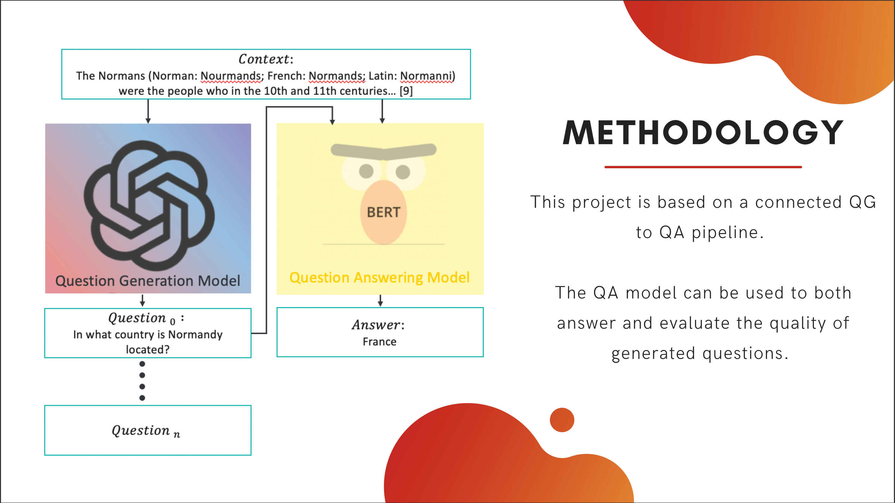

# Question Generation and Question Answering - SQuAD & QuAC

This project was produced as a final year project for Queen's Univeristy Belfast. 

## Description

Training a large language model on SQuAD or QuAC is not novel in the language model space, however, this project focuses more on the interlinking of the two tasks while also analysing context. 

For Question Answering BERT is used by providing a question and context paragraph to the model and analysing the response against the ground truth. This is trained on both SQuAD and QuAC. 

For Question Generation GPT-2 is used, where a context paragraph and question are supplied to the model to learn how to generate new questions. 

These two models are used in conjunction to analyse whether the QA model can answer questions generated by the QG model. 

The folders in this project contain:

* QA - training and evaluation of BERT for QA on SQuAD and QuAC
* QGen - data pre-processing for GPT-2, training and evaluation of GPT-2 for QGen on SQuAD and QuAC
* Evaluation - calculation of BLEU and Meteor scores, evaluation of QA answering QGen and visualisations

## QG

### Training

The GPT-2 model is trained seperately on the SQuAD and QuAC datasets, hypertuning using a grid search is also performed. 

The best resulting model is taken and used to generate a number of questions for a given context paragraph. 

### Evaluation

The generated questions are evaluated using the BLEU and Meteor scores and whether they are able to be answered by the QA model. The generated questions are measured against the ground truth question for the context paragraph. 

## QA

### Training

The BERT model is trained, with the QA head, seperately on the SQuAD and QuAC datasets, it is also hypertuned using a grid search approach.

### Evaluation

The model is evaluated during training with the test data, against the ground truth answers. It is also further evaluated with BLEU and Meteor scores, both on the provided validation data and the generated questions.

## Evaluation 

## Pipeline Approach 

Both models are interlinked in terms of their use and testing. With Generation models being hard to evaluate with metrics we use  BLEU, Meteor and the QA models, matching the dataset of the QG model, to evaluate the generation. 

We deem the QG model generated questions as 'good' if:

1. The measure against groundtruth is above a threshold value of 0.2 for both BLEU and Meteor
2. If the QA model is able to answer 

While QA models were tested on their repsective trained QG dataset, we also tested if the highest performing SQuAD model was able to answer QuAC generated questions. The SQuAD QA model outperformed the QuAC QA model in answering the generated QuAC questions. Concluding that this model could be applied to other datasets. 

An analysis was also performed to understand the types of questions being asked - Who, What, Where, When, Why, How etc. - to understand the dataset split. This analysis should have been used to clean the dataset into even question categories, as we saw in evaluation that the QG models were generating more of the majority question type due to the skew. 
